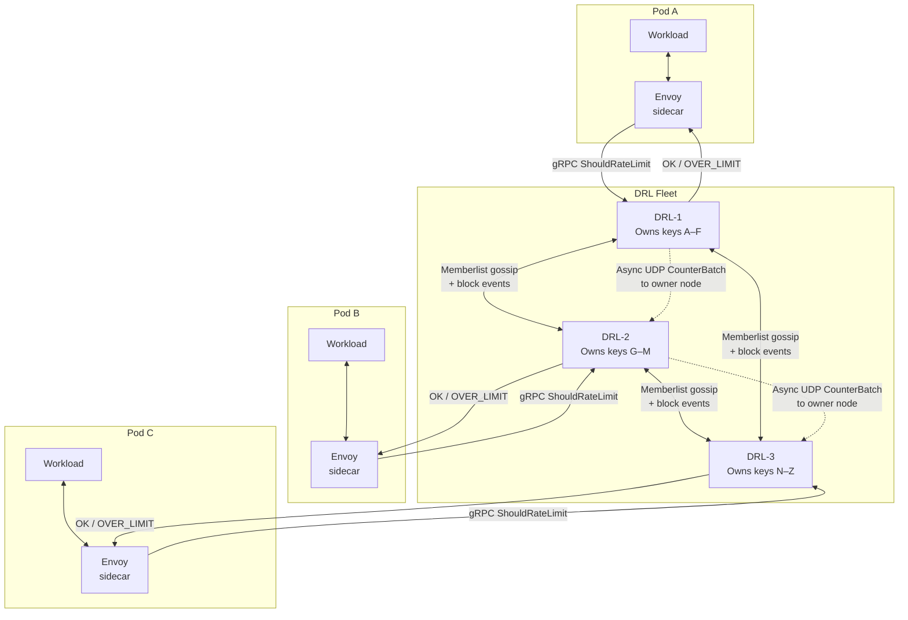

# DRL — Distributed Rate Limiter

A high-performance, horizontally scalable rate-limiting service designed for Envoy sidecars. DRL eliminates
the latency of external databases by using a **Peer-to-Peer Hybrid Architecture**:

- **Local enforcement** — fully-replicated in-memory Blocklist for O(1) rejection
- **Shadow accounting** — hashed, asynchronous global quota tracking
- **Warm-bootstrap** — state sync on startup prevents vulnerability windows during rolling updates

## Infrastructure overview

## Documentation

| Topic | Description |
|-------|-------------|
| [Getting Started](https://drl.gchiesa.dev/) | Quick start and overview |
| [Configuration](https://drl.gchiesa.dev/configuration/) | Complete KDL config reference and environment variables |
| [Membership](https://drl.gchiesa.dev/membership/) | Cluster formation, gossip, warm-bootstrap, block propagation |
| [Cache](https://drl.gchiesa.dev/cache/) | In-memory blocklist and accounting cache architecture |
| [Accounting](https://drl.gchiesa.dev/accounting/) | Shadow accounting, entity hashing, batched flushing |
| [gRPC API](https://drl.gchiesa.dev/api/) | Envoy `ratelimit.v3` service implementation |
| [Internal HTTP API](https://drl.gchiesa.dev/internal-api/) | Management endpoints and digest authentication |

## CI reports

Reports are published to GitHub Pages after each successful run on `main`.

| Job | Report |
|-----|--------|
| Functional (1 replica) | [functional-single-instance](https://drl.gchiesa.dev/reports/functional-single-instance/) |
| Functional (5 replicas) | [functional-5-instances](https://drl.gchiesa.dev/reports/functional-5-instances/) |
| Functional (10 replicas) | [functional-10-instances](https://drl.gchiesa.dev/reports/functional-10-instances/) |
| Handover | [handover](https://drl.gchiesa.dev/reports/handover/) |
| Performance | [performance](https://drl.gchiesa.dev/reports/performance/) |

## License

MIT
