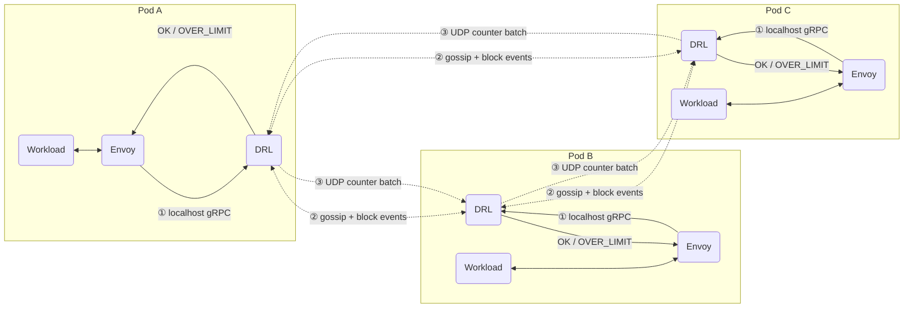
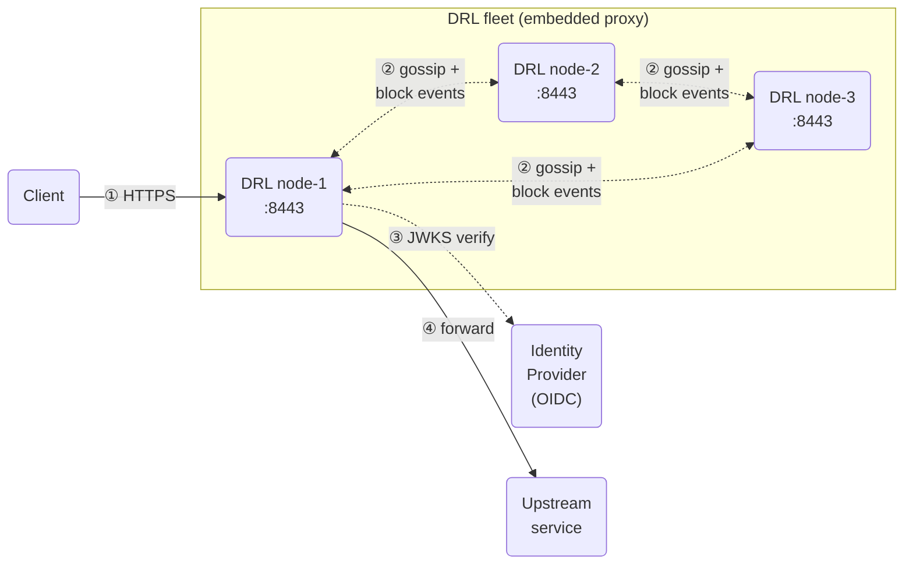

# DRL — Distributed Rate Limiter

DRL is a high-performance, horizontally scalable rate-limiting service. It eliminates the latency of external
databases by keeping all enforcement state in-process across a self-organising peer-to-peer cluster — no Redis,
no Memcached, no coordinator.

Whether you already run **Envoy** in your infrastructure or you need a **lightweight standalone gateway**, DRL
has a deployment mode that fits.

---

## Features

🚀 **Sub-millisecond enforcement** — Block decisions are O(1) in-process blocklist lookups. No network round-trip,
no external store, no cache miss. The hot path returns in microseconds.

🔗 **Native Envoy / gRPC ext_authz integration** — Implements the `ratelimit.v3` / `ext_authz.v3` gRPC protocol.
Point Envoy's `rate_limit_service` at `localhost:8081` and it just works — same-pod loopback, zero TLS overhead.

🌐 **Embedded reverse proxy** — No Envoy in your stack? Enable DRL's built-in HTTP/HTTPS proxy and it becomes
your complete API gateway: TLS termination, OIDC JWT validation, rate-limiting, and upstream forwarding — all
in a single binary.

🔒 **TLS + OIDC out of the box** — The embedded proxy terminates TLS without writing certificate material to
disk, and validates Bearer tokens against any OIDC-compliant identity provider (Keycloak, Auth0, Okta, Entra ID).
Per-route scope enforcement is supported.

🌍 **Truly peer-to-peer** — All nodes are equal. Scale the fleet up or down and the consistent-hash ring
rebalances automatically. No leader election, no external service registry, no coordinator to become a bottleneck.

⚡ **Asynchronous off the critical path** — Counter forwarding to the hash-ring owner and block-event gossip
both happen in background goroutines, strictly after the response has already been returned to the client.

🔄 **Warm bootstrap** — New nodes perform a full blocklist state-sync before serving traffic, eliminating the
"vulnerability window" that plagues naive rolling-update strategies.

📊 **Built-in control plane UI** — A real-time cluster dashboard is served directly from the DRL binary.
Cross-node metrics aggregation, blocklist inspection, and configuration review — no external monitoring stack
required to get started.

🏷️ **Rich entity model** — Rate limits are not IP-only. Each entity is a composite key of
`IP + URI path + zero or more header values`, giving fine-grained per-client, per-route, per-API-key control.

---

## Deployment modes

DRL supports two complementary deployment models. Pick the one that matches your infrastructure.

### Mode 1 — Envoy / gRPC ext_authz (primary)

The canonical DRL deployment: DRL runs as a second sidecar alongside Envoy (or any gRPC proxy that speaks
`ext_authz.v3`). The `Check` call resolves over the loopback interface — there is no network hop, no DNS
resolution, no TLS handshake. Rate-limit enforcement is effectively a function call.

All the heavy lifting — counter ownership, block propagation, state sync — happens asynchronously between DRL
peers over the cluster network, completely off Envoy's request path.

### Mode 2 — Embedded proxy (standalone)

No Envoy? Enable DRL's built-in reverse proxy. DRL listens on a configurable port, terminates TLS, optionally
validates OIDC Bearer tokens per route, enforces rate limits, and forwards to your upstream — all in a single
process.

Best suited for:

- Internal APIs or microservices where a full Envoy deployment is not warranted
- Environments where operational simplicity outweighs the need for deep proxy customisation
- Local development and integration testing

---

## Architecture

### Envoy sidecar topology

| | Path | Transport | Blocks Envoy? |
|-|------|-----------|:-------------:|
| ① | Envoy → DRL block check | localhost gRPC | yes — microseconds |
| ② | DRL → DRL block propagation | Memberlist gossip (UDP/TCP) | no — fire and forget |
| ③ | DRL → owner counter increment | UDP `CounterBatch` | no — fire and forget |

DRL's primary deployment model is as a **second sidecar in the same pod as Envoy**. The `ShouldRateLimit`
gRPC call never crosses a network boundary — it resolves over the loopback interface, eliminating DNS
resolution, TLS negotiation, and switch hops from the enforcement path entirely. Block decisions are
O(1) in-process blocklist lookups that return in microseconds.

Everything else — counter forwarding to the consistent-hash owner and block-event gossip across the cluster —
happens **asynchronously, after the response has already been returned to Envoy**. A slow peer, a GC pause, or
a temporary network partition between DRL instances never delays a rate-limit decision.

---

### Embedded proxy topology

When Envoy is not in the picture, DRL's embedded proxy takes over the full ingress role.

| | Step | Description |
|-|------|-------------|
| ① | Client → DRL | HTTPS (TLS terminated by DRL; cert never touches disk) |
| ② | DRL ↔ DRL | Gossip mesh — block events propagate cluster-wide |
| ③ | DRL → IdP | JWKS fetch to verify `Authorization: Bearer` token signature and claims |
| ④ | DRL → Upstream | Plain HTTP forward after all checks pass |

OIDC validation and scope enforcement are configured per virtual-host and per-route. Routes without
`require-auth` skip the JWT step entirely. The full middleware order is:
**TLS termination → OIDC JWT validation → rate-limit blocklist check → upstream forward**.

---

## Design philosophy: availability over consistency

> *A request that slips through once costs nothing. A rate limiter that adds latency to every request costs everything.*

DRL is built on a deliberate trade-off: **it tolerates a brief window where a handful of requests may pass
through after a limit is triggered**, in exchange for never needing an external store and keeping the
enforcement path at sub-millisecond latency.

| Property | Traditional centralised approach (Redis / Memcached) | DRL |
|----------|------------------------------------------------------|-----|
| **Enforcement latency** | +1–5 ms per request (network round-trip to store) | ~0 ms (in-process blocklist lookup) |
| **External dependency** | Required — the store is a single point of failure | None — each node is self-contained |
| **Sidecar deployment** | Sidecar still calls out over the network | Sidecar calls `localhost` — same OS network namespace |
| **Consistency window** | Strong (synchronous write before OK) | Eventual — gossip convergence typically < 1 s |
| **Failure mode** | Store outage → rate limiting fails open or hard | Node isolation → local blocklist still enforces; remote counters lag |

### About the eventual consistency trade-off

The scenarios where a few requests sneak through are narrow and short-lived:

1. **Sub-second gossip convergence** — when a block is decided on the owner node, Serf/Memberlist
   propagates the event cluster-wide in well under a second. The "leak window" is bounded by gossip
   latency, not by request rate.
2. **Repeat offenders are caught locally** — once a block event reaches a node, every subsequent request
   from that entity is rejected at the in-process blocklist check before the response is even assembled.
3. **The alternative is worse** — synchronous distributed consensus on every request serialises traffic
   through a bottleneck, adds tail latency to the hot path, and introduces a new failure domain. DRL
   eliminates all three problems.
4. **Sidecar topology amplifies the benefit** — when deployed as a sidecar next to Envoy, the gRPC
   `ShouldRateLimit` call never leaves the host. There is no network hop, no TLS handshake overhead,
   and no DNS resolution. The blocklist lookup is effectively a function call.

For the overwhelming majority of rate-limiting use cases — API abuse prevention, bot mitigation, per-user
quota enforcement — a sub-second enforcement window is operationally indistinguishable from strong
consistency, while the latency and reliability properties are dramatically better.

---

## Control Plane UI

DRL ships a built-in web dashboard for real-time cluster monitoring — no external tools required.

The dashboard is served directly from the DRL binary at `http://<node>:8082/v1/ui/`. Access is
zero-touch: the browser performs an automatic ECDH key exchange on page load, establishing an encrypted
session without any manual login. Metrics from all cluster nodes are aggregated in real time.

See the [UI documentation](https://drl.gchiesa.dev/docs/ui/) for access instructions, authentication
details, and deployment examples.

---

## Documentation

| Topic | Description |
|-------|-------------|
| [Getting Started](https://drl.gchiesa.dev/) | Quick start and overview |
| [Configuration](https://drl.gchiesa.dev/docs/configuration/) | Complete KDL config reference and environment variables |
| [Embedded Proxy](https://drl.gchiesa.dev/docs/embedded-proxy/) | TLS, OIDC JWT validation, virtual hosts, and upstream routing |
| [Membership](https://drl.gchiesa.dev/docs/membership/) | Cluster formation, gossip, warm-bootstrap, block propagation |
| [Cache](https://drl.gchiesa.dev/docs/cache/) | In-memory blocklist and accounting cache architecture |
| [Accounting](https://drl.gchiesa.dev/docs/accounting/) | Shadow accounting, entity hashing, batched flushing |
| [gRPC API](https://drl.gchiesa.dev/docs/api/) | Envoy `ratelimit.v3` / `ext_authz.v3` service implementation |
| [Internal HTTP API](https://drl.gchiesa.dev/docs/internal-api/) | Management endpoints and digest authentication |
| [Control Plane UI](https://drl.gchiesa.dev/docs/ui/) | Built-in web dashboard: access, authentication, and cross-node metrics aggregation |
| [Metrics](https://drl.gchiesa.dev/docs/metrics/) | Prometheus metrics reference, label definitions, and Grafana panel queries |
| [Sizing Guide](https://drl.gchiesa.dev/docs/sizing/) | Memory footprint, capacity tables, and deployment recommendations |
| [Deployment Models](https://drl.gchiesa.dev/docs/deployments/) | Docker Compose, ECS Fargate, Kubernetes sidecar/fleet, and Istio configurations |

---

## Deployment flavours

Ready-to-use deployment configurations live under [`deployments/`](deployments/):

| Flavour | Path | Infrastructure | Description |
|---------|------|----------------|-------------|
| [Docker Compose](deployments/docker-compose/README.md) | `deployments/docker-compose/` | Local machine | Full stack via `docker compose up` — fastest way to try DRL |
| [ECS Sidecar](deployments/ecs-sidecar/README.md) | `deployments/ecs-sidecar/` | AWS ECS Fargate (Terraform) | echo-server + envoy + DRL as co-located Fargate task sidecars |
| [K8s Sidecar](deployments/k8s-sidecar/README.md) | `deployments/k8s-sidecar/` | Any Kubernetes cluster (Kustomize) | DRL as a third container inside each application pod |
| [K8s Fleet](deployments/k8s-fleet/README.md) | `deployments/k8s-fleet/` | Any Kubernetes cluster (Kustomize) | DRL as a dedicated Deployment; Envoy connects via ClusterIP Service |
| [Istio](deployments/istio/README.md) | `deployments/istio/` | Istio service mesh | Configuration guide: inject DRL into existing Istio-managed sidecars via `EnvoyFilter` / `AuthorizationPolicy` |

---

## CI reports

Reports are published to GitHub Pages after each successful run on `main`.

| Job | Goal | Pipeline | Report |
|-----|------|----------|--------|
| Lint & Unit Tests | Runs `golangci-lint` and `go test -race ./...` with coverage on every push. | [runs on main](https://github.com/gchiesa/drl/actions/workflows/ci.yml?query=branch%3Amain) | — |
| Functional (1 replica) | Validates core rate-limiting correctness on a single node: requests below the threshold are allowed; requests above it are blocked at the configured ratio. | [runs on main](https://github.com/gchiesa/drl/actions/workflows/ci.yml?query=branch%3Amain) | [report](https://drl.gchiesa.dev/reports/functional-single-instance/) |
| Functional (5 replicas) | Same correctness check on a 5-node cluster. Verifies that block events propagate via gossip and are enforced cluster-wide, not just on the owner node. | [runs on main](https://github.com/gchiesa/drl/actions/workflows/ci.yml?query=branch%3Amain) | [report](https://drl.gchiesa.dev/reports/functional-5-instances/) |
| Functional (10 replicas) | Stress-tests gossip convergence and consistent-hash ownership at a larger scale. Confirms allowed/blocked ratios stay within acceptable thresholds as the ring grows. | [runs on main](https://github.com/gchiesa/drl/actions/workflows/ci.yml?query=branch%3Amain) | [report](https://drl.gchiesa.dev/reports/functional-10-instances/) |
| Handover | Verifies graceful state transfer during a rolling update: a leaving node evacuates its accounting counters to a peer, so rate-limit enforcement continues uninterrupted after scale-down. | [runs on main](https://github.com/gchiesa/drl/actions/workflows/ci.yml?query=branch%3Amain) | [report](https://drl.gchiesa.dev/reports/handover/) |
| Performance | Measures sustained throughput and p95/p99 latency of the `ShouldRateLimit` gRPC path under a ramp-up traffic model. Establishes a baseline for regression detection. | [runs on main](https://github.com/gchiesa/drl/actions/workflows/performance.yml?query=branch%3Amain) | [report](https://drl.gchiesa.dev/reports/performance/) |

---

## License

DRL is released under the [Apache License 2.0](LICENSE).

Copyright 2024 Giuseppe Chiesa

Licensed under the Apache License, Version 2.0 (the "License"); you may not use this software except in compliance
with the License. You may obtain a copy of the License at <http://www.apache.org/licenses/LICENSE-2.0>.

Unless required by applicable law or agreed to in writing, software distributed under the License is distributed on
an "AS IS" BASIS, WITHOUT WARRANTIES OR CONDITIONS OF ANY KIND, either express or implied. See the LICENSE file for
the specific language governing permissions and limitations under the License.
