# DRL — Distributed Rate Limiter

A high-performance, horizontally scalable rate-limiting service designed for Envoy sidecars. DRL eliminates
the latency of external databases by using a **Peer-to-Peer Hybrid Architecture**:

- **Local enforcement** — fully-replicated in-memory Blocklist for O(1) rejection
- **Shadow accounting** — hashed, asynchronous global quota tracking
- **Warm-bootstrap** — state sync on startup prevents vulnerability windows during rolling updates

## Infrastructure overview

```mermaid
graph TB
    subgraph pod-a ["Pod A"]
        WA["Workload"] <--> EA["Envoy\nsidecar"]
    end
    subgraph pod-b ["Pod B"]
        WB["Workload"] <--> EB["Envoy\nsidecar"]
    end
    subgraph pod-c ["Pod C"]
        WC["Workload"] <--> EC["Envoy\nsidecar"]
    end

    EA -->|"gRPC ShouldRateLimit"| DRL1
    EB -->|"gRPC ShouldRateLimit"| DRL2
    EC -->|"gRPC ShouldRateLimit"| DRL3

    subgraph drl-fleet ["DRL Fleet"]
        DRL1["DRL-1\nOwns keys A–F"]
        DRL2["DRL-2\nOwns keys G–M"]
        DRL3["DRL-3\nOwns keys N–Z"]
        DRL1 <-->|"Memberlist gossip\n+ block events"| DRL2
        DRL2 <-->|"Memberlist gossip\n+ block events"| DRL3
        DRL1 <-->|"Memberlist gossip\n+ block events"| DRL3
    end

    DRL1 -->|"OK / OVER_LIMIT"| EA
    DRL2 -->|"OK / OVER_LIMIT"| EB
    DRL3 -->|"OK / OVER_LIMIT"| EC

    DRL1 -.->|"Async UDP CounterBatch\nto owner node"| DRL2
    DRL2 -.->|"Async UDP CounterBatch\nto owner node"| DRL3
```

## Documentation

| Topic | Description |
|-------|-------------|
| [Getting Started](https://gchiesa.github.io/drl/) | Quick start and overview |
| [Configuration](https://gchiesa.github.io/drl/configuration/) | Complete KDL config reference and environment variables |
| [Membership](https://gchiesa.github.io/drl/membership/) | Cluster formation, gossip, warm-bootstrap, block propagation |
| [Cache](https://gchiesa.github.io/drl/cache/) | In-memory blocklist and accounting cache architecture |
| [Accounting](https://gchiesa.github.io/drl/accounting/) | Shadow accounting, entity hashing, batched flushing |
| [gRPC API](https://gchiesa.github.io/drl/api/) | Envoy `ratelimit.v3` service implementation |
| [Internal HTTP API](https://gchiesa.github.io/drl/internal-api/) | Management endpoints and digest authentication |

## CI reports

| Job | Description | Reports |
|-----|-------------|---------|
| Unit Tests | Lint + Go unit tests with coverage | [Pipeline dashboard](https://app.circleci.com/pipelines/github/gchiesa/drl?branch=main) |
| Functional (1 replica) | Single-instance rate limiting | Artifacts → `functional-test-report` |
| Functional (5 replicas) | 5-node cluster functional test | Artifacts → `functional-test-report` |
| Functional (10 replicas) | 10-node cluster functional test | Artifacts → `functional-test-report` |
| Handover Test | Graceful state handover during rolling update | Artifacts → `handover-test-report` |
| Performance Test | Throughput benchmark (main branch only) | Artifacts → `performance-test-report` |

Test artifacts are stored per pipeline run. Navigate to the relevant pipeline in the
[CircleCI dashboard](https://app.circleci.com/pipelines/github/gchiesa/drl) and open the **Artifacts** tab
of the corresponding job.

## License

MIT
