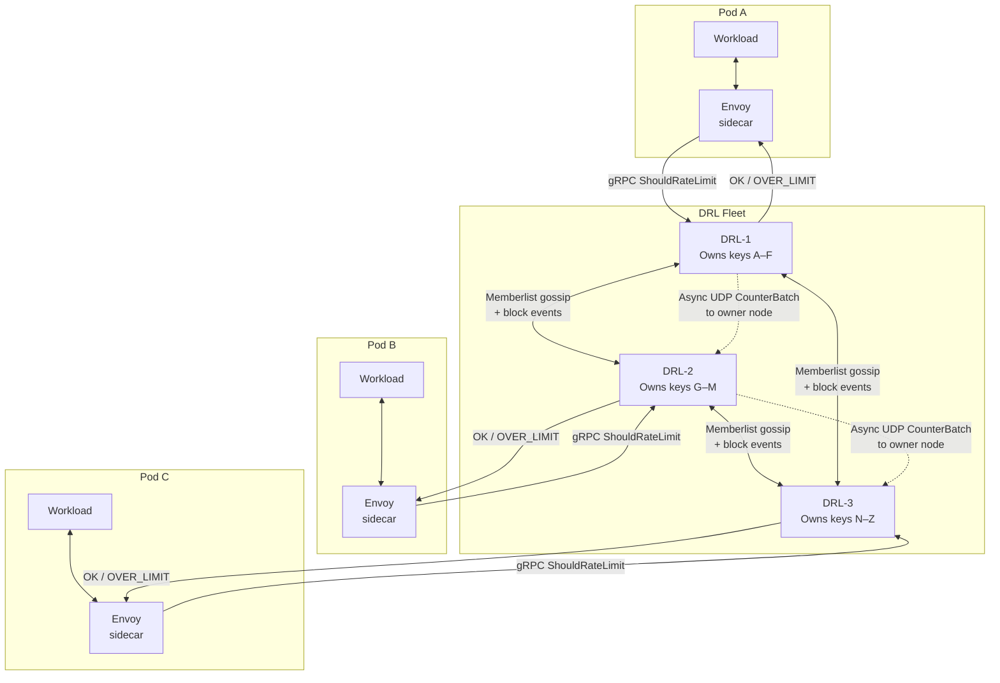

# DRL — Distributed Rate Limiter

> [!WARNING]
> This project is in **alpha**. APIs, configuration format, and wire protocols may change without notice. Do not use in production.

A high-performance, horizontally scalable rate-limiting service designed for Envoy sidecars. DRL eliminates
the latency of external databases by using a **Peer-to-Peer Hybrid Architecture**:

- **Local enforcement** — fully-replicated in-memory Blocklist for O(1) rejection
- **Shadow accounting** — hashed, asynchronous global quota tracking
- **Warm-bootstrap** — state sync on startup prevents vulnerability windows during rolling updates

## Infrastructure overview

## Design philosophy: availability over consistency

> *A request that slips through once costs nothing. A rate limiter that adds latency to every request costs everything.*

DRL is built on a deliberate trade-off: **it tolerates a brief window where a handful of requests may pass
through after a limit is triggered**, in exchange for never needing an external store and keeping the
enforcement path at sub-millisecond latency.

| Property | Traditional centralised approach (Redis / Memcached) | DRL |
|----------|------------------------------------------------------|-----|
| **Enforcement latency** | +1–5 ms per request (network round-trip to store) | ~0 ms (in-process blocklist lookup) |
| **External dependency** | Required — the store is a single point of failure | None — each node is self-contained |
| **Sidecar deployment** | Sidecar still calls out over the network | Sidecar calls `localhost` — same OS network namespace |
| **Consistency window** | Strong (synchronous write before OK) | Eventual — gossip convergence typically < 1 s |
| **Failure mode** | Store outage → rate limiting fails open or hard | Node isolation → local blocklist still enforces; remote counters lag |

### Why eventual consistency is the right trade-off here

The scenarios where a few requests sneak through are narrow and short-lived:

1. **Sub-second gossip convergence** — when a block is decided on the owner node, Serf/Memberlist
   propagates the event cluster-wide in well under a second. The "leak window" is bounded by gossip
   latency, not by request rate.
2. **Repeat offenders are caught locally** — once a block event reaches a node, every subsequent request
   from that entity is rejected at the in-process blocklist check before the response is even assembled.
3. **The alternative is worse** — synchronous distributed consensus on every request serialises traffic
   through a bottleneck, adds tail latency to the hot path, and introduces a new failure domain. DRL
   eliminates all three problems.
4. **Sidecar topology amplifies the benefit** — when deployed as a sidecar next to Envoy, the gRPC
   `ShouldRateLimit` call never leaves the host. There is no network hop, no TLS handshake overhead,
   and no DNS resolution. The blocklist lookup is effectively a function call.

For the overwhelming majority of rate-limiting use cases — API abuse prevention, bot mitigation, per-user
quota enforcement — a sub-second enforcement window is operationally indistinguishable from strong
consistency, while the latency and reliability properties are dramatically better.

## Documentation

| Topic | Description |
|-------|-------------|
| [Getting Started](https://drl.gchiesa.dev/) | Quick start and overview |
| [Configuration](https://drl.gchiesa.dev/configuration/) | Complete KDL config reference and environment variables |
| [Membership](https://drl.gchiesa.dev/membership/) | Cluster formation, gossip, warm-bootstrap, block propagation |
| [Cache](https://drl.gchiesa.dev/cache/) | In-memory blocklist and accounting cache architecture |
| [Accounting](https://drl.gchiesa.dev/accounting/) | Shadow accounting, entity hashing, batched flushing |
| [gRPC API](https://drl.gchiesa.dev/api/) | Envoy `ratelimit.v3` service implementation |
| [Internal HTTP API](https://drl.gchiesa.dev/internal-api/) | Management endpoints and digest authentication |
| [Metrics](https://drl.gchiesa.dev/metrics/) | Prometheus metrics reference, label definitions, and Grafana panel queries |
| [Sizing Guide](https://drl.gchiesa.dev/sizing/) | Memory footprint, capacity tables, and deployment recommendations |

## CI reports

Reports are published to GitHub Pages after each successful run on `main`.

| Job | Goal | Pipeline | Report |
|-----|------|----------|--------|
| Lint & Unit Tests | Runs `golangci-lint` and `go test -race ./...` with coverage on every push. | [runs on main](https://github.com/gchiesa/drl/actions/workflows/ci.yml?query=branch%3Amain) | — |
| Functional (1 replica) | Validates core rate-limiting correctness on a single node: requests below the threshold are allowed; requests above it are blocked at the configured ratio. | [runs on main](https://github.com/gchiesa/drl/actions/workflows/ci.yml?query=branch%3Amain) | [report](https://drl.gchiesa.dev/reports/functional-single-instance/) |
| Functional (5 replicas) | Same correctness check on a 5-node cluster. Verifies that block events propagate via gossip and are enforced cluster-wide, not just on the owner node. | [runs on main](https://github.com/gchiesa/drl/actions/workflows/ci.yml?query=branch%3Amain) | [report](https://drl.gchiesa.dev/reports/functional-5-instances/) |
| Functional (10 replicas) | Stress-tests gossip convergence and consistent-hash ownership at a larger scale. Confirms allowed/blocked ratios stay within acceptable thresholds as the ring grows. | [runs on main](https://github.com/gchiesa/drl/actions/workflows/ci.yml?query=branch%3Amain) | [report](https://drl.gchiesa.dev/reports/functional-10-instances/) |
| Handover | Verifies graceful state transfer during a rolling update: a leaving node evacuates its accounting counters to a peer, so rate-limit enforcement continues uninterrupted after scale-down. | [runs on main](https://github.com/gchiesa/drl/actions/workflows/ci.yml?query=branch%3Amain) | [report](https://drl.gchiesa.dev/reports/handover/) |
| Performance | Measures sustained throughput and p95/p99 latency of the `ShouldRateLimit` gRPC path under a ramp-up traffic model. Establishes a baseline for regression detection. | [runs on main](https://github.com/gchiesa/drl/actions/workflows/performance.yml?query=branch%3Amain) | [report](https://drl.gchiesa.dev/reports/performance/) |

## License

MIT
