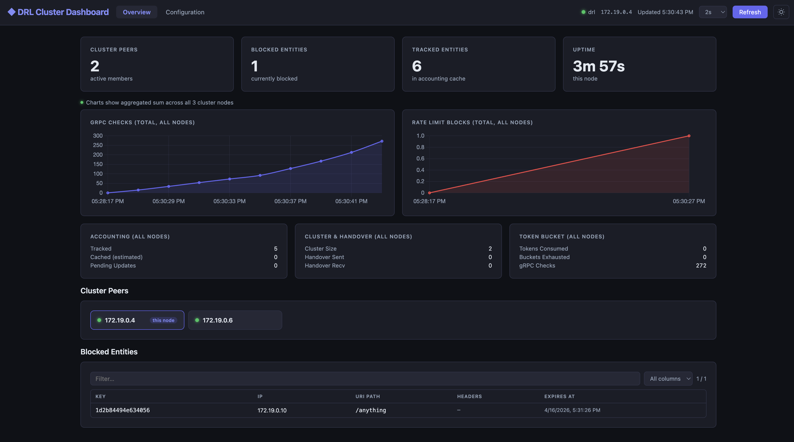
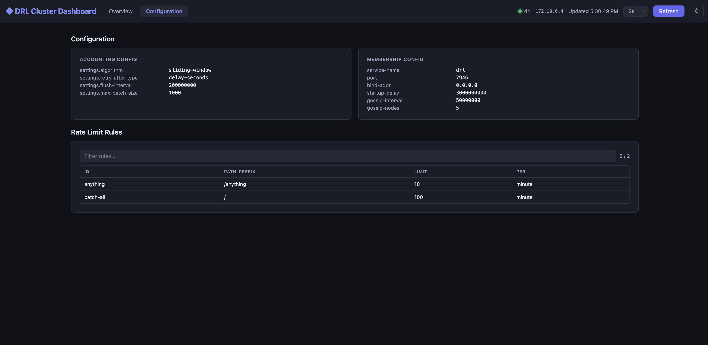

DRL includes a built-in **Control Plane UI**: a single-page web dashboard that gives you a live view of
the entire cluster — blocked entities, rate-limit metrics, node health, and configuration — served
directly from the DRL binary with no external dependencies.



## URL

The UI is served on the **private API port** (`8082` by default):

```
http://<node-address>:8082/drl/ui/
```

Every DRL node exposes its own instance of the dashboard. Once open, the SPA automatically queries
peer nodes via the built-in proxy and aggregates their metrics, so you get a cluster-wide view
regardless of which node you connect to.

## Authentication and encryption

Access to the UI follows a **high-security, two-step flow**: the bootstrap token is never embedded
in the HTML. An operator must retrieve it out-of-band using Digest authentication and paste it into
the token modal that appears on first load.

### Retrieving the access token

Before opening the UI, obtain the bootstrap token using `curl` with Digest credentials:

```bash
curl --digest -u "admin:$DRL_PRIVATE_API_KEY" http://localhost:8082/drl/ui/get-token
```

The response is a JSON object:

```json
{"bootstrap_token": "<short-lived-token>"}
```

The token is valid for **10 minutes** and can only be used once (for the ECDH key exchange).
Retrieve a fresh one each time you open the dashboard.

### How it works


sequenceDiagram
    participant O  as Operator (curl)
    participant B  as Browser (SPA)
    participant S  as DRL node

    O->>S: GET /drl/ui/get-token (Digest auth)
    S-->>O: {"bootstrap_token": "..."}
    note over O: Copy token to clipboard

    B->>S: GET /drl/ui/ → HTML with &lt;meta name="drl-bootstrap"&gt; (no token)
    note over B: Token modal appears — user pastes token
    B->>B: Generate ephemeral ECDH P-256 key pair
    B->>S: POST /drl/ui/exchange {clientPublicKey, bootstrapToken}
    S->>S: Validate bootstrap token (HMAC-SHA256, 10 min TTL)
    S->>S: Derive shared secret via ECDH
    S->>S: Create session; encrypt session token with AES-256-GCM
    S-->>B: {serverPublicKey, iv, encryptedSession}
    B->>B: Derive same shared secret via ECDH
    B->>B: Decrypt session token with AES-256-GCM
    note over B: Session established — token held in memory only
    B->>S: GET /drl/ui/api/metrics (Authorization: DRL-Session &lt;token&gt;)
    S-->>B: JSON metrics snapshot


### Step by step

1. **Token retrieval** — the operator calls `GET /drl/ui/get-token` with HTTP Digest credentials.
   The server generates a short-lived bootstrap token (HMAC-SHA256, 10-minute TTL) and returns it
   as JSON. The token is never embedded in the HTML, so it cannot be intercepted by passive
   network observers or cached by proxies.

2. **Token modal** — when the browser opens the UI, a non-dismissible modal prompts the operator
   to paste the token retrieved in step 1.

3. **ECDH key exchange** — the SPA generates an ephemeral **ECDH P-256** key pair in the browser
   via the Web Crypto API. It posts the public key along with the bootstrap token to
   `POST /drl/ui/exchange`.

4. **Shared secret derivation** — both sides independently derive the same 256-bit shared secret
   using Diffie-Hellman. Neither side ever transmits the secret itself.

5. **Session token delivery** — the server creates a signed session token and encrypts it with
   **AES-256-GCM** using the shared secret before sending it back. Only the browser, which holds
   the private key, can derive the decryption key.

6. **Authenticated requests** — the SPA decrypts the session token and uses it as
   `Authorization: DRL-Session <token>` on all subsequent API calls. The token is held in
   JavaScript memory only — it is never written to `localStorage` or cookies, so it disappears
   when the tab is closed, requiring a fresh token on the next visit.

7. **Cross-node validation** — because all DRL nodes share the same API key, they derive the
   same HMAC signing key. A session token issued by any node is cryptographically valid on all
   peers, which is what makes the proxy feature work.

### Dual-auth for CLI access

The same API endpoints also accept **HTTP Digest authentication** (SHA-256), so `curl` and automated
scripts continue to work without changes alongside browser sessions.

## Cross-node metrics aggregation

The UI connects to a single node but shows **aggregated metrics across the whole cluster**.



When the SPA loads the cluster status it receives the list of peer API addresses. It then issues
parallel requests through the **built-in proxy**:

```
GET /drl/ui/proxy/<peer-host:port>/drl/ui/api/metrics
```

The receiving node forwards the request to the target peer, attaching the caller's session token.
Because session tokens are cluster-wide (see cross-node validation above), the peer accepts the
request and returns its local metrics. The SPA sums all values before rendering charts and KPI
cards, and labels every widget with "all nodes" to make aggregation explicit.

## Accessing the UI with Docker Compose

The Docker Compose deployment does not publish the private API port (`8082`) to the host by default.
Use `socat` to forward it:

```bash
docker run --rm -p 8082:8082 \
  --network $(docker network ls -qf "name=docker-compose_drl-network") \
  alpine/socat \
  TCP-LISTEN:8082,fork TCP:docker-compose-drl-1:8082
```

This creates a tunnel from `localhost:8082` into the DRL cluster network and forwards to the first
DRL replica (`docker-compose-drl-1`). Then open:

```
http://localhost:8082/drl/ui/
```

The dashboard will automatically discover and aggregate metrics from all other replicas in the cluster
via the proxy mechanism — you get a full cluster view even though you are connected to a single node.

> **Tip** — you can tunnel to any replica, not just the first one. All nodes expose the full UI and
> proxy to their peers. Replace `docker-compose-drl-1` with `docker-compose-drl-2` etc. to connect
> to a different node.

### Generating traffic to visualise

The Docker Compose stack publishes **Envoy's ingress port** (`10000`) on the host. You can send
requests directly from your browser or with `curl` to watch the rate-limiter in action:

```
http://localhost:10000/anything
```

Reload repeatedly (or use a tool like `k6` or `hey`) to ramp up traffic and watch the Blocked
Entities counter climb and the rate-limit charts update in the dashboard.

## Dashboard sections

| Section | Description |
|---------|-------------|
| **Cluster Overview** | KPI cards (peers, blocked entities, tracked entities, uptime), real-time line charts for gRPC checks and rate-limit blocks, sorted peer list with per-node status indicators, and a searchable/filterable blocked-entities table. All numeric widgets show the sum across all cluster nodes. |
| **Configuration** | Key-value view of the active accounting and membership configuration, followed by a flat, filterable table of every configured rate-limit rule. |

## Auto-refresh

The dashboard refreshes automatically. The default interval is **30 seconds**; the header toolbar
offers a selector to switch to 1, 2, 5, 10, or 15 seconds for more responsive monitoring during
active incidents.

## Light / dark mode

A theme toggle in the header switches between dark (default) and light mode. The preference is
persisted in `localStorage`.
