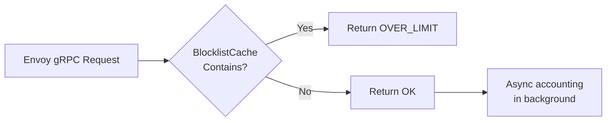

The `internal/cache` package owns the two hot-path data stores that every Envoy request touches:

| Store | Purpose | Lookup cost |
|-------|---------|-------------|
| `BlocklistCache` | Fully-replicated map of blocked entities with TTLs | O(1) |
| `AccountingCache` | Per-entity request counters (owner-node only) | O(1) |

Both caches are backed by **[Otter](https://github.com/maypok86/otter)**, a high-concurrency, GC-friendly cache
library that avoids the lock contention of `sync.Map` and the GC overhead of pointer-heavy data structures.

## BlocklistCache

The blocklist is the primary enforcement mechanism. Every DRL node maintains a **complete replica** of the
cluster-wide blocklist so that any node can reject a blocked entity instantly, without network round-trips.



### API

```go
// NewBlocklistCache creates a new blocklist cache with a maximum item count.
func NewBlocklistCache(maxItems int64) (*BlocklistCache, error)

// Add inserts or refreshes an entity key with the given TTL.
func (c *BlocklistCache) Add(key string, ttl time.Duration) error

// Contains reports whether the key is currently blocked.
func (c *BlocklistCache) Contains(key string) bool

// Delete removes an entity key (for manual unblock via the Internal API).
func (c *BlocklistCache) Delete(key string)

// GetSnapshot returns a point-in-time copy of all active entries with their
// remaining TTLs. Used by StateDelegate for Push/Pull state sync.
func (c *BlocklistCache) GetSnapshot() map[string]time.Duration

// MergeSnapshot hydrates the cache from a snapshot received during warm-bootstrap.
func (c *BlocklistCache) MergeSnapshot(snap map[string]time.Duration) error
```

### Size configuration

```kdl
cache {
    blocklist-size-mb 64   // Maximum RAM for blocklist entries (default: 64 MB)
}
```

Environment variable: `DRL_CACHE_BLOCKLIST_SIZE_MB`

Otter enforces the size limit through its internal admission policy — entries are evicted when the limit is
approached. Because the blocklist is replicated, an entry evicted from one node is still held by peers until
the TTL expires naturally.

### TTL behaviour

Entries are inserted with explicit TTLs. The TTL source depends on the operation:

| Operation | TTL source |
|-----------|-----------|
| Rate-limit breach (automatic) | `accounting.rules.<name>` blocklist-ttl (TBD per-rule) |
| Manual block via Internal API | `cache.blocklist-default-ttl-seconds` (default: 300 s) unless overridden by `?ttl=` query param |
| Warm-bootstrap merge | Original TTL from the snapshot |

```kdl
cache {
    blocklist-default-ttl-seconds 300   // Default TTL for admin-API blocks
}
```

## AccountingCache

The accounting cache stores per-entity request counters on the **owner node** only. Non-owner nodes forward
increments to the owner via the Flusher (see [Accounting](./accounting)).

```go
// NewAccountingCache creates a new accounting cache sized by the config.
func NewAccountingCache(cfg config.AccountingConfig) (*AccountingCache, error)

// Increment atomically adds delta to the counter and returns the new value.
func (c *AccountingCache) Increment(key string, delta int64) (int64, error)

// Get returns the current counter value.
func (c *AccountingCache) Get(key string) (int64, bool)

// Set overwrites the counter (used during handover merge).
func (c *AccountingCache) Set(key string, value int64) error

// Reset removes a counter (e.g. after blocking the entity).
func (c *AccountingCache) Reset(key string)

// Close releases resources.
func (c *AccountingCache) Close()
```

### Size configuration

```kdl
cache {
    accounting-size-mb 128   // Maximum RAM for accounting counters (default: 128 MB)
}
```

Environment variable: `DRL_CACHE_ACCOUNTING_SIZE_MB`

### State sync timeout

```kdl
cache {
    sync-timeout-seconds 30   // Max wait for initial Memberlist state sync (default: 30 s)
}
```

Environment variable: `DRL_CACHE_SYNC_TIMEOUT_SECONDS`

If the sync does not complete within this timeout, the node proceeds to serve traffic anyway. This prevents
stuck deployments when the cluster is empty (first node) or when a peer is unreachable.
